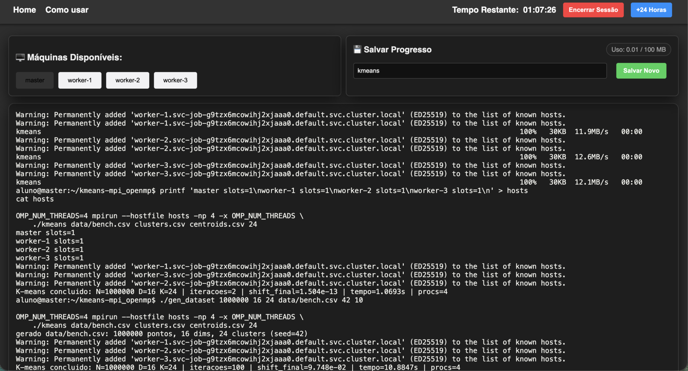

# Clustering de grandes conjuntos de dados com K-means usando MPI + OpenMP

> **Disciplina:** Introdução ao Processamento Paralelo e Distribuído
> **Tema:** Clustering de grandes conjuntos de dados com K-means (MPI + OpenMP)
> **Autor:** Daniel Lisboa Pereira
> **Data:** julho de 2026

---

## 1. Introdução

O agrupamento (*clustering*) é uma tarefa fundamental de aprendizado não
supervisionado: dado um conjunto de registros, deseja-se particioná-los em
grupos (*clusters*) de forma que registros semelhantes fiquem no mesmo grupo. O
algoritmo **K-means** é o método mais difundido para essa tarefa, mas seu custo
cresce linearmente com o número de pontos, de dimensões e de clusters, tornando
o processamento de **grandes conjuntos de dados** caro em uma única máquina/thread.

Este trabalho implementa o K-means explorando **dois níveis de paralelismo**:

- **MPI** (memória distribuída) para dividir os registros entre processos, que
  podem estar em nós diferentes, e para realizar a **redução global dos
  centroides** a cada iteração;
- **OpenMP** (memória compartilhada) para paralelizar, dentro de cada processo,
  o **cálculo das distâncias** entre pontos e centroides — a parte mais cara do
  algoritmo.

Um requisito prático do ambiente-alvo é que **os nós MPI não compartilham
disco**. Isso é tratado explicitamente pela arquitetura do programa, descrita na
Seção 4.

## 2. Fundamentação teórica

### 2.1. O algoritmo K-means (Lloyd)

Dado um conjunto de `N` pontos em `R^D` e um número `K` de clusters, o K-means
busca `K` centroides que minimizem a soma das distâncias quadráticas de cada
ponto ao seu centroide mais próximo (a *inércia*). O algoritmo de Lloyd itera
dois passos até a convergência:

1. **Atribuição:** cada ponto é associado ao centroide mais próximo (distância
   euclidiana).
2. **Atualização:** cada centroide é recalculado como a média dos pontos que lhe
   foram atribuídos.

O custo por iteração é `O(N · K · D)`, dominado pelo passo de atribuição.

### 2.2. Inicialização k-means++

A qualidade do resultado depende fortemente dos centroides iniciais. A
inicialização aleatória simples pode colocar dois centroides no mesmo grupo,
levando a um mínimo local ruim. O **k-means++** escolhe o primeiro centroide
uniformemente e cada centroide seguinte com probabilidade proporcional ao
**quadrado da distância** ao centroide mais próximo já escolhido, espalhando as
sementes e melhorando muito a qualidade e a velocidade de convergência.

### 2.3. MPI e OpenMP

**MPI** (*Message Passing Interface*) é o padrão para paralelismo em **memória
distribuída**: processos independentes, possivelmente em nós distintos,
comunicam-se por troca de mensagens (`MPI_Scatterv`, `MPI_Allreduce`, etc.).

**OpenMP** é o padrão para paralelismo em **memória compartilhada**: diretivas
`#pragma omp` criam threads que compartilham a memória do processo, ideal para
paralelizar laços.

A combinação (**modelo híbrido**) explora a hierarquia real das máquinas atuais:
MPI entre nós/processos e OpenMP entre os núcleos de cada nó.

## 3. O problema do disco não-compartilhado

No ambiente MPI-alvo, cada processo pode executar em um nó com seu **próprio
sistema de arquivos**. Um arquivo visível ao rank 0 pode não existir nos demais
nós. Assim, a estratégia ingênua — cada processo abre o CSV e lê sua fatia —
**falharia**, pois só um dos nós enxerga o arquivo.

**Solução adotada:** concentrar **todo** o acesso a disco no rank 0.

- Somente o rank 0 lê o CSV de entrada e escreve os CSVs de saída.
- Os dados são distribuídos aos demais processos **pela rede** (`MPI_Scatterv`);
  os rótulos resultantes retornam ao rank 0 pela rede (`MPI_Gatherv`).
- Nenhum outro processo executa operações de arquivo.

Essa decisão isola a dependência de disco em um único ponto e torna o programa
correto independentemente de o sistema de arquivos ser compartilhado ou não.

## 4. Arquitetura e implementação

O código está organizado em módulos com responsabilidades bem definidas:

| Arquivo | Responsabilidade |
|---|---|
| `src/main.c` | Orquestração MPI: partição, `Scatterv`, `Allreduce`, `Gatherv`, loop |
| `src/kmeans.c` | Atribuição (OpenMP), atualização de centroides, distâncias |
| `src/io.c` | Leitura/escrita de CSV (**apenas rank 0**) |
| `tools/gen_dataset.c` | Geração de datasets sintéticos (blobs gaussianos) |

### 4.1. Fluxo de execução

1. O **rank 0** lê o CSV para a memória (`N×D`) e escolhe `K` centroides
   iniciais por k-means++.
2. `MPI_Bcast` difunde `N`, `D`, `K` e os centroides iniciais.
3. `MPI_Scatterv` distribui os pontos: cada rank recebe um bloco de
   aproximadamente `N/P` pontos (contagens e deslocamentos calculados para
   dividir o resto de forma equilibrada).
4. **Loop de Lloyd**, executado por todos os ranks:
   - **Atribuição (OpenMP):** para cada ponto local, calcula-se a distância
     euclidiana ao quadrado a cada centroide e escolhe-se o menor. O laço é
     paralelizado com `#pragma omp parallel for`; cada thread acumula somas e
     contagens por cluster em **buffers privados**, fundidos ao final numa
     região crítica — evitando contenção no laço quente.
   - **Redução global (MPI):** `MPI_Allreduce` com `MPI_SUM` soma, entre todos
     os processos, as coordenadas acumuladas (`K×D`) e as contagens (`K`).
   - **Atualização:** cada rank divide soma por contagem, obtendo centroides
     **idênticos** em todos os processos, e mede o deslocamento máximo.
   - **Convergência:** encerra quando o deslocamento máximo `< tol`.
5. `MPI_Gatherv` reúne os rótulos no rank 0, que escreve `clusters.csv` e
   `centroids.csv`.

### 4.2. Por que `MPI_Allreduce`

Poder-se-ia usar `MPI_Reduce` (concentrando a soma no rank 0) seguido de
`MPI_Bcast` dos novos centroides. Optou-se por `MPI_Allreduce` porque ele já
devolve o resultado a **todos** os ranks: cada processo recalcula os centroides
e avalia a convergência localmente, com o mesmo resultado, sem uma etapa extra
de broadcast. Como todos partem dos mesmos dados reduzidos, a execução é
determinística e o resultado independe do número de processos.

### 4.3. Casos de borda

- **Cluster vazio** (nenhum ponto atribuído numa iteração): o centroide anterior
  é mantido.
- **Validação de entrada:** falha de abertura de arquivo, CSV malformado (com o
  número da linha), `K < 1` ou `K > N` abortam a execução com `MPI_Abort` e uma
  mensagem clara.
- **Reprodutibilidade:** a inicialização usa semente fixa, garantindo resultados
  idênticos entre execuções.

## 5. Metodologia experimental

Os experimentos usaram **dois ambientes**, cada um exercendo melhor um nível de
paralelismo.

### 5.1. Ambiente principal — cluster Xivoco (plataforma da disciplina)

- **Infraestrutura:** 4 nós (`master` + 3 `worker`), cada um um contêiner (pod
  Kubernetes) da imagem `mpi-node`, com **disco não compartilhado** entre os nós
  — exatamente o cenário tratado na Seção 3.
- **Limite de CPU:** cada pod é limitado a **1 vCPU** pela cota de *cgroup*
  (`/sys/fs/cgroup/cpu.max` = `100000 100000`), embora `nproc` reporte 4 (os
  núcleos do nó físico, não a cota do contêiner). Consequência: o paralelismo
  **entre nós (MPI)** ganha uma vCPU a cada nó adicionado, mas o paralelismo de
  **threads (OpenMP) dentro de um pod** não encontra núcleos livres para ocupar.
- **Toolchain:** OpenMPI + GCC `-O3 -fopenmp`.
- **Dataset:** `N = 1.000.000` pontos, `D = 16`, `K = 24` (`spread = 10`). O
  número de iterações foi fixado no teto (**100 iterações**), garantindo carga
  **idêntica** em todas as configurações e isolando o *speedup* de efeitos de
  convergência.
- **Execução distribuída:** o binário é replicado nos nós via `scp` (o disco não
  é compartilhado); os **dados ficam só no rank 0**; roda-se com
  `mpirun --hostfile ... -np P --bind-to none -x OMP_NUM_THREADS`.

### 5.2. Ambiente de referência — máquina multicore

Como cada pod do Xivoco tem apenas 1 vCPU, a escalabilidade **OpenMP** (memória
compartilhada) foi medida numa máquina **multicore de 10 núcleos**, para
demonstrar o ganho das threads quando há núcleos disponíveis. Dataset
`N = 1.000.000`, `D = 16`, `K = 24` (`spread = 2`, ~38 iterações).

### 5.3. Medida

O tempo reportado é o do **núcleo paralelo** (distribuição + iterações + coleta),
obtido com `MPI_Wtime`; a leitura/escrita de arquivo e o *seeding* serial ficam
**fora** da medição, por serem pré-processamento não paralelizado. O *speedup* é
`tempo_base / tempo(config)`.

## 6. Resultados

### 6.1. Cluster Xivoco — escalabilidade MPI entre nós

Variando o número de nós MPI (`P`), com 1 vCPU por pod (`T = 1`):

| Nós (P) | vCPUs | Tempo (s) | Speedup |
|:---:|:---:|:---:|:---:|
| 1 | 1 | 29.59 | 1.00 |
| 2 | 2 | 15.42 | 1.92 |
| 4 | 4 |  8.13 | 3.64 |

O *speedup* é **quase linear** (eficiência de ~91% em 4 nós). Isso valida o cerne
do trabalho: a distribuição dos registros por `MPI_Scatterv` e a redução global
dos centroides por `MPI_Allreduce` escalam bem entre nós que **não compartilham
memória nem disco**. A execução distribuída também confirmou, na prática, o
**contorno do disco não-compartilhado**: apenas o rank 0 (no `master`) leu o CSV;
os demais nós receberam seus blocos pela rede.

*Figura 1 — Execução nos 4 nós do Xivoco: o binário é replicado nos workers via
`scp`, o hostfile lista os 4 nós (`slots=1`) e a saída `procs=4` confirma a
execução distribuída; o rank 0, no `master`, foi o único a acessar o disco.*

**Por que as threads OpenMP não ajudam no Xivoco.** Acrescentar threads não
reduz o tempo — chega a piorar:

| Configuração | Tempo (s) |
|:---|:---:|
| 1 nó × 1 thread  | 29.59 |
| 1 nó × 4 threads | 31.57 |
| 4 nós × 1 thread |  8.13 |
| 4 nós × 4 threads | 10.86 |

A causa é o limite de **1 vCPU por pod**: as threads de um mesmo processo disputam
o único núcleo disponível, sem ganho e ainda com *overhead* de gerência. Não é
limitação do código — é do ambiente. (Detalhe de execução: sem `--bind-to none`,
o OpenMPI ainda fixa cada processo a um núcleo por padrão, agravando o efeito; a
flag foi usada em todas as medições.)

### 6.2. Máquina multicore de referência — escalabilidade OpenMP e híbrida

Na máquina de 10 núcleos, onde há núcleos livres para as threads, os **dois**
níveis de paralelismo contribuem:

| Processos (P) | Threads (T) | Tempo (s) | Speedup |
|:---:|:---:|:---:|:---:|
| 1 | 1 | 14.11 | 1.00 |
| 1 | 2 |  7.31 | 1.93 |
| 1 | 4 |  3.99 | 3.54 |
| 2 | 1 |  7.46 | 1.89 |
| 2 | 2 |  4.21 | 3.35 |
| 2 | 4 |  2.64 | 5.35 |
| 4 | 1 |  4.33 | 3.26 |
| 4 | 2 |  2.69 | 5.24 |
| 4 | 4 |  2.62 | 5.38 |

- **Escalabilidade OpenMP** (fixando `P=1`): 1.93× com 2 threads e 3.54× com 4 — o
  passo de atribuição é altamente paralelizável, com pouca sincronização (apenas
  a fusão dos buffers por thread).
- **Escalabilidade MPI** (fixando `T=1`): 1.89× e 3.26×; ganho ligeiramente menor
  por causa da comunicação do `Allreduce` a cada iteração.
- **Modelo híbrido:** as melhores marcas (~5.4×) vêm da combinação (`2×4`, `4×4`),
  aproveitando as duas vias de paralelismo dentro dos 10 núcleos.

### 6.3. Síntese

O Xivoco (ambiente exigido) demonstra a **escalabilidade MPI** e o **contorno do
disco não-compartilhado** em nós realmente separados; a máquina multicore
demonstra a **escalabilidade OpenMP** que o limite de 1 vCPU por pod impede de
observar no cluster. Juntos, os dois ambientes confirmam que **ambos** os níveis
de paralelismo funcionam, e a validação `serial ≡ paralelo` (Seção 4.3) garante
que a paralelização não altera o resultado.

## 7. Conclusão

Implementou-se o K-means para grandes conjuntos de dados com paralelismo
híbrido: MPI distribuindo os registros e reduzindo globalmente os centroides, e
OpenMP paralelizando o cálculo das distâncias locais. A restrição de **disco não
compartilhado** foi resolvida centralizando todo o I/O no rank 0 e distribuindo
os dados pela rede com `Scatterv`/`Gatherv` — o que foi confirmado **na prática**
no cluster Xivoco, com nós (pods) realmente separados.

No Xivoco, a escalabilidade **MPI** foi quase linear (**3.64×** em 4 nós,
eficiência ~91%); a escalabilidade **OpenMP** não pôde ser exercida ali por cada
pod ter apenas 1 vCPU, mas foi confirmada na máquina multicore, onde o modelo
híbrido atingiu **~5.4×**. Em ambos os ambientes, a validação mostrou que a
versão paralela produz **exatamente o mesmo resultado** da serial.

## Referências

1. Lloyd, S. P. *Least squares quantization in PCM*. IEEE Transactions on
   Information Theory, 1982.
2. Arthur, D.; Vassilvitskii, S. *k-means++: The Advantages of Careful Seeding*.
   SODA, 2007.
3. MPI Forum. *MPI: A Message-Passing Interface Standard*.
4. OpenMP Architecture Review Board. *OpenMP Application Programming Interface*.
